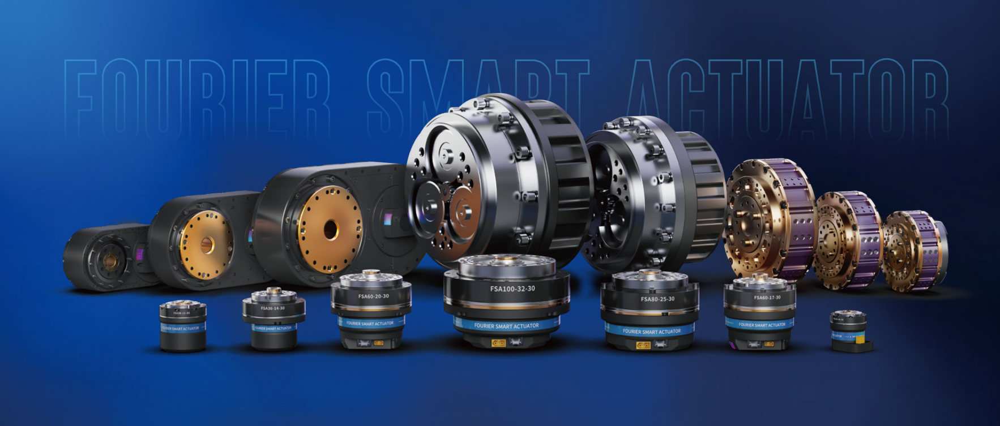
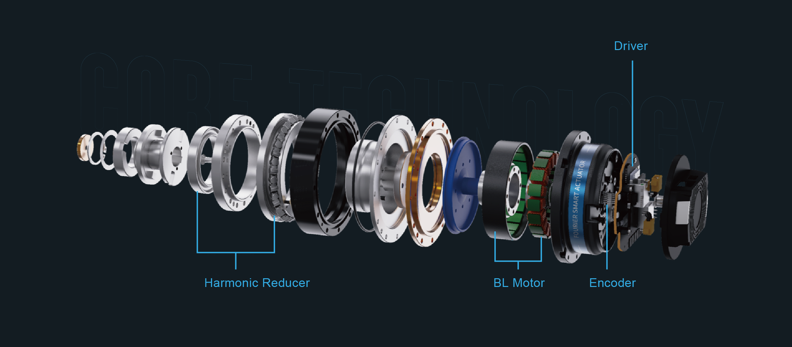

# What it is

> Where smart motion masters meet integrated excellence.

The FSA Actuator Series represents a remarkable leap in the world of motion control. One of the defining characteristics of the FSA Actuator Series is its highly integrated design.

Unlike traditional servo systems that involve multiple separate components, these actuators bring together everything you need within a minimalistic and compact form factor. Within this unified structure, brushless motors, reducers, encoders, and drivers seamlessly coexist.

This integration serves a dual purpose: it not only minimizes the overall system size but also greatly bolsters system reliability. In the following chapters, we will explore the key features and benefits of this pioneering technology in detail.

### The Power Quartet: Driver, Harmonic Reducer, Brushless Motor, and Encoder

At the heart of the FSA Actuator Series lies a quartet of essential components - the driver, harmonic reducer, brushless motor, and encoder. Let's take a closer look at each of these elements:

#### 1. Driver

The driver in the FSA Actuator Series plays a pivotal role in controlling and powering the system. It ensures precision in motion and responsiveness to external commands. With its advanced capabilities, this driver contributes to the superior performance of the actuators.

#### 2. Harmonic Reducer

The harmonic reducer, integrated into the actuator, facilitates precise control over motion. Its efficiency and compactness make it a perfect fit for various applications. By minimizing backlash and providing excellent torque transmission, it significantly enhances the actuator's overall performance.

#### 3. Brushless Motor

The brushless motor is the powerhouse of the FSA Actuator Series. Known for its reliability and efficiency, it delivers the necessary torque for a wide range of tasks. Whether it's smooth and precise movements or handling heavy loads, the brushless motor excels in every scenario.

#### 4. Encoder

The encoder is a critical component that provides real-time feedback on the actuator's position and movement. It ensures accurate positioning and contributes to the overall precision of the system.

## Features

### Arc-Second-Level Repeatable Positioning Accuracy

The FSA Actuator Series boasts high-precision encoders and advanced control algorithms, effortlessly achieving arc-second-level repeatable positioning accuracy. This level of precision allows for fine control and precision in various applications.

### Ultra-High Torque Density for Direct Force Control

By coupling a first-stage reduction with high torque density motors, the FSA Actuator Series achieves direct force control with exceptional impact resistance. This combination of components enables precise control and robust performance even in challenging conditions.

### Cutting-Edge Connectivity with EtherCAT

In a world where communication is key, the FSA Actuator Series embraces EtherCAT high-speed Ethernet communication technology. This feature empowers the actuators to seamlessly connect and communicate with other devices and systems.

#### Versatile Networking

EtherCAT, with its full-duplex communication technology, enables the creation of various network topologies. This versatility ensures compatibility with a wide range of complex application scenarios. The network exhibits low latency, minimal jitter, and outstanding reliability, making it an ideal choice for demanding applications.

#### Enhanced Data Transfer

The FSA Actuator Series leverages EtherCAT to achieve a remarkable 90% increase in maximum effective data transfer rates compared to conventional systems. This improvement in data transfer rates leads to more responsive and efficient control, enhancing overall system performance.

#### Reduced CPU Load

Additionally, the adoption of EtherCAT technology reduces the CPU load by up to 20%, ensuring that the system operates efficiently and effectively, even under heavy workloads.

### High-Speed Ethernet Architecture

The FSA Actuator Series seamlessly integrates with 100M Ethernet, offering a robust electronic and electrical architecture. This integration further enhances its compatibility with modern industrial environments and control systems.
