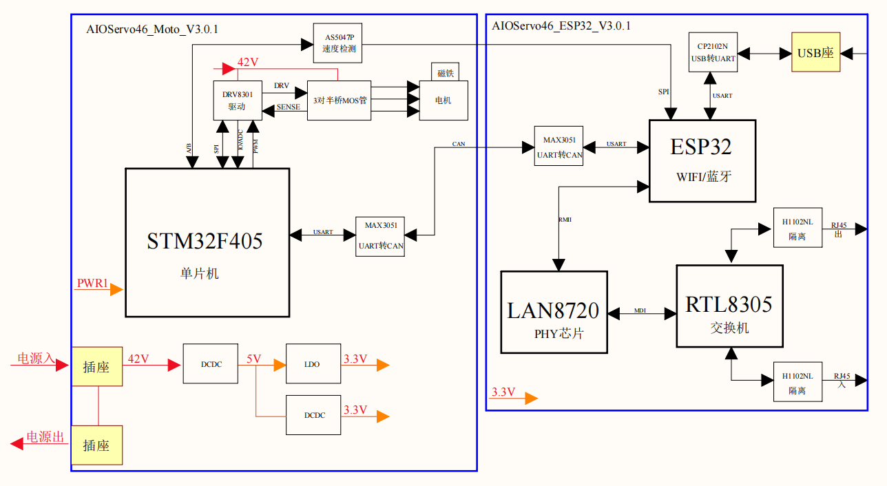

## Functional Schematic

This schematic is a blueprint that outlines how the motor , a pivotal component in robotic arm functionality, is wired and operates within the system.

Data begins its journey from the STM32F405 microcontroller, which is the primary processing unit. It sends control commands through USART and CAN communication interfaces. The USART is further interfaced with a MAX3051 chip, which converts these signals to CAN protocol, allowing for robust industrial communication.

The DRV8301 motor driver receives the control commands and translates them into precise electrical currents to drive the motor. This driver is connected to the ESP32, which can communicate via Wi-Fi/Bluetooth for wireless control capabilities, adding another layer of data flow for remote operation or monitoring.

The AS5047P magnetic encoder plays a crucial role by providing real-time feedback on the motor's position via SPI interface back to the microcontroller. This feedback loop is vital for adjusting the motor's movement to achieve the desired position with high accuracy.

Power management is illustrated with a series of DC-DC converters and LDOs ensuring the different components receive the correct voltages. These power components not only supply power but also protect the system against electrical anomalies, contributing to the overall data integrity and safety.

This high-level overview of the data flow emphasizes the seamless interaction between processing, control, and feedback elements, creating a sophisticated and responsive system for motor control within the robotic arm.

## The Motor Driver (DRV8301)

### Introduction to the DRV8301

At the heart of the motor's motion lies the DRV8301, a motor driver integrated circuit (IC) that serves as the intermediary between the microcontroller's commands and the motor's actions. This IC is not only compact but also powerful, capable of handling the intricate demands of controlling the robotic arm's motor.

### Functional Capabilities

The DRV8301's primary functions include:

* **Speed Control** : It modulates the power to the motor to achieve a range of speeds, from delicate, precise movements to rapid motions.
* **Direction Control** : By changing the polarity of the motor's supply voltage, the DRV8301 can reverse the motor's direction.
* **Torque Management** : It adjusts the current supply to the motor, controlling the torque and thus the force with which the robotic arm moves.

### Interfacing with the Microcontroller

The motor driver IC receives digital signals from the microcontroller, which contain instructions regarding the desired speed, direction, and torque. It translates these signals into the appropriate analog outputs to drive the motor.

### Pin Layout and Signal Inputs

* **Power Supply Pins** : These connect to the power source and are designed to handle the IC's voltage and current requirements.
* **Output Pins** : Connected directly to the motor, these pins deliver the driving signals that control motor function.
* **Input Pins** : These receive logic signals from the microcontroller that dictate motor behavior.
* **Feedback Pins** : Used to send information back to the microcontroller, these pins report on the motor's status, including fault conditions.

### Power Outputs

The DRV8301 provides power to the motor through three half-bridges capable of high current output. It can support both brushed and brushless motors, accommodating a variety of robotic arm designs.

### Protecting the System

Integral to the DRV8301 are various protection features, including under-voltage lockout, over-current protection, and thermal shutdown. These are critical in preventing damage to both the motor driver and the motor itself under extreme operating conditions.

### Diagnostics and Reporting

The DRV8301 is equipped with diagnostic capabilities that provide real-time feedback on the state of the motor and the IC itself. Fault conditions, such as over-temperature or over-current, can be communicated back to the microcontroller, enabling swift corrective action.

## The Magnetic Encoder (AS5047P)

### The Essence of Positional Feedback

The AS5047P magnetic encoder plays a critical role in the precision control of the robotic arm. This encoder is a type of sensor that detects the angular position of the motor's shaft using magnetic fields. By providing real-time positional feedback to the microcontroller, it ensures that the robotic arm's movements are both accurate and consistent.

It is not just a sensor; it is a fundamental part of the robotic arm's control system, allowing for the sophisticated movements required in advanced automation. Its ability to provide precise positional feedback is what makes complex robotic tasks possible.

### How the AS5047P Works

* **Magnetic Sensing** : The AS5047P utilizes a magnet attached to the motor shaft. As the shaft rotates, the encoder senses the changing magnetic field.
* **Position Calculation** : It then converts these magnetic field changes into digital signals that represent the motor shaft's exact position.
* **Resolution and Precision** : With a high-resolution output, it can detect minute changes in position, essential for fine control of the robotic arm.

### Integration with the Motor Control System

* **Feedback Loop** : The encoder's data is fed into a feedback loop where it is compared with the desired position (as instructed by the microcontroller). If discrepancies are found, adjustments are made to the motor's drive signals, correcting the arm's movement in real-time.
* **Speed Determination** : Besides position, the AS5047P's data can be used to calculate the speed of the motor by measuring how quickly the position changes over time.

### The Encoder's Output

* **Digital Interface** : The AS5047P typically communicates with the microcontroller via a digital interface, such as SPI (Serial Peripheral Interface), providing high-speed data transmission.
* **Diagnostics** : It can also report on its status and health, alerting the system to potential issues like misalignment or a malfunctioning magnet.

### Importance in Troubleshooting

Understanding the AS5047P's operation is key in diagnosing issues with the robotic arm. If the arm is not moving correctly, the encoder's readings can be monitored to see if it's providing the correct positional data. Any discrepancies here can lead to targeted maintenance, ensuring the arm's optimal performance.

## Power Management Chips

### The Backbone of Electrical Stability

In the realm of robotic arms, power management is not just about supplying energy; it's about ensuring that this power is delivered in a stable, efficient, and safe manner. This is where power management chips come into play, serving as guardians of the robotic arm's electrical system.

### Roles of Power Management Chips

* **Voltage Regulation** : These chips ensure that the voltage supplied to the motor and other components is stable and within their operational limits. This is crucial as fluctuations can lead to inefficiencies or even damage to sensitive electronic components.
* **Current Distribution** : They manage how current is distributed to various parts of the robotic arm. This includes not only the motor but also sensors, encoders, and the control unit. Proper current distribution is key to balanced performance across all systems.
* **Protection Mechanisms** : Power management chips incorporate several protection features, such as over-current protection, which safeguards the system against excessive current that could cause overheating or damage. They also often include thermal protection to shut down the system safely in case of overheating.

### Understanding Power Pathways

* **From Source to Component** : We will explore the journey of electrical power from its source, through the power management chips, and to the various components of the robotic arm.
* **Efficiency in Power Conversion** : These chips are not just pass-through devices; they optimize power usage, converting higher voltages to lower ones where necessary, and ensuring that power is not wasted.

### Safeguards and Diagnostics

* **Real-time Monitoring** : Many power management chips come equipped with diagnostic capabilities, allowing for real-time monitoring of voltage and current levels. This can be crucial for predictive maintenance and avoiding unexpected downtimes.
* **Fault Detection and Response** : In the event of an electrical anomaly, these chips can detect the issue and respond appropriately, often shutting down the affected circuit to prevent further damage.

## The Microcontroller (STM32F405)

At the center of the schematic is the STM32F405 microcontroller, the brains behind the operation. It processes input from sensors, sends control signals to the motor driver, and executes the software that makes the robotic arm intelligent. This section breaks down the microcontroller's specifications, programming, and connectivity with other components.

[stm32f405](https://www.st.com/resource/en/datasheet/stm32f405oe.pdf)

## Communication Interfaces

### The Lifelines of Connectivity

For a robotic arm, effective communication with external devices and systems is as crucial as its mechanical movements. This section sheds light on the various communication interfaces that form the nexus between the robotic arm and the outer world. We focus on USB, CAN, and USART interfaces, each serving a unique role in data transfer and command reception.

### USB (Universal Serial Bus)

* **Function** : USB interfaces are commonly used for direct connections to computers or other control systems. They are ideal for high-speed data transfer and command input.
* **Application** : In robotic arms, USB can be used for tasks like firmware updates, parameter configuration, or data logging.
* **Technical Insight** : We'll explore the USB's data transfer rates, connector types, and protocol standards relevant to robotic arm applications.

### CAN (Controller Area Network)

* **Function** : CAN is a robust communication protocol designed for reliable communication in harsh environments, making it well-suited for industrial robotic applications.
* **Application** : It's used for networking multiple robotic arms or connecting the arm to industrial control systems.
* **Technical Insight** : This section will delve into CAN's multi-master design, message prioritization, and error-handling capabilities.

### USART (Universal Synchronous/Asynchronous Receiver/Transmitter)

#### Function

USART is a communication interface integral to microcontroller-based systems, offering flexibility with its dual modes: synchronous for clocked data exchange and asynchronous for start-stop communication. This versatility is essential for the multifaceted communication demands of robotic systems.

#### Application

In robotic arms, USART interfaces are paramount for issuing real-time control commands, which dictate the movements and actions of the arm. They also serve to relay sensor data back to the control unit, enabling responsive adjustments to the arm's operation. Moreover, USARTs facilitate backward compatibility with older technologies, allowing integration with legacy systems in an industrial setting.

#### Technical Insight

The technicalities of USART involve configuring baud rates—the speed of communication—ensuring the data rate matches on both communicating devices. Synchronization mechanisms are critical, especially in synchronous mode, where precise timing between sender and receiver is maintained. Framing structures define the format of a data packet, including start and stop bits in asynchronous mode, and data bits, parity, and error checking. In robotic arms, these parameters are meticulously tuned to ensure accurate and reliable data transfer in controlling actuators and reading sensor feedback.

### Protocols, Wiring, and Data Flow

* **Protocols** : Understanding the communication protocols is key to ensuring compatibility and efficiency in data exchange.
* **Wiring and Physical Connections** : Proper wiring is crucial for reliable communication. This section will guide you through the best practices for wiring and connection.
* **Data Flow Analysis** : We will examine how data flows through these interfaces, enabling the robotic arm to receive commands and export data seamlessly.

### Protocols, Wiring, and Data Flow

The schematic delineates the protocol hierarchy within the motor driver circuitry. Utilizing industry-standard communication protocols, it ensures synchronized data exchange between the motor driver and the controlling firmware. The precision of SPI and USART protocols in the schematic facilitates a seamless and error-free dialogue for command execution and status reporting.

Wiring integrity is paramount, as illustrated. The schematic specifies the gauge, shielding, and routing of wires, which are vital for maintaining signal integrity under electromechanical stresses encountered during operation.

Data flow analysis in the schematic is comprehensive, tracing the journey of command and control signals from their origin to execution. This includes pathways for power signals, feedback loops for system status, and interrupt signals for real-time adjustments, culminating in an integrated network of bidirectional data exchange.

Data begins its journey from the STM32F405 microcontroller, which is the primary processing unit. It sends control commands through USART and CAN communication interfaces. The USART is further interfaced with a MAX3051 chip, which converts these signals to CAN protocol, allowing for robust industrial communication.

The DRV8301 motor driver receives the control commands and translates them into precise electrical currents to drive the motor. This driver is connected to the ESP32, which can communicate via Wi-Fi/Bluetooth for wireless control capabilities, adding another layer of data flow for remote operation or monitoring.

The AS5047P magnetic encoder plays a crucial role by providing real-time feedback on the motor's position via SPI interface back to the microcontroller. This feedback loop is vital for adjusting the motor's movement to achieve the desired position with high accuracy.

Power management is illustrated with a series of DC-DC converters and LDOs ensuring the different components receive the correct voltages. These power components not only supply power but also protect the system against electrical anomalies, contributing to the overall data integrity and safety.

This high-level overview of the data flow emphasizes the seamless interaction between processing, control, and feedback elements, creating a sophisticated and responsive system for motor control within the robotic arm.

[h1102nl](https://productfinder.pulseelectronics.com/api/open/part-attachments/datasheet/h1102nl)

[cp2102n](https://www.silabs.com/documents/public/user-guides/ug254-cp2102n-miniek.pdf)

# Functional Schematic of the FSA Actuator

## Introduction

In this technical document, we will delve into the functional schematic of the FSA (Functional Schematic Actuator), a critical component of our robotic arm system. This document is aimed at providing a comprehensive understanding of the FSA's functionality based on its schematic representation.

## Overview of the Schematic

The functional schematic of the FSA provides a visual representation of how data flows and controls the motor within our robotic arm system. It serves as a blueprint for understanding the intricate interplay of components, interfaces, and communication pathways. Let's break down the schematic to uncover its key elements and their roles in the FSA's operation.

### Central Processing Unit: STM32F405

At the core of the schematic lies the STM32F405 microcontroller, which acts as the brain of our robotic arm system. It is responsible for initiating and transmitting control commands to various components. The STM32F405 communicates through both USART and CAN communication interfaces, enabling seamless data exchange with other elements of the system.

- **USART Interface**: The microcontroller interfaces with a MAX3051 chip via USART, which plays a crucial role in converting signals to the CAN protocol, ensuring robust industrial communication.

### Motor Control with DRV8301

The DRV8301 motor driver is a key player in motor motion control within the robotic arm. It serves as the intermediary between the microcontroller's commands and the motor's actions. The DRV8301 offers a range of capabilities, including speed control, direction control, and torque management, making it a versatile and powerful component.

- **SPI Interface**: The DRV8301 is connected to the microcontroller through a bidirectional SPI interface, facilitating high-speed data exchange.
- **IO/ADC and PWM Connections**: Additional connections include IO/ADC for input/output and analog-to-digital conversion, as well as PWM for pulse-width modulation, enabling precise motor control.

### Real-time Feedback from AS5047P

The AS5047P magnetic encoder is a critical component that provides real-time feedback on the motor's position via the SPI interface. This feedback loop is essential for fine-tuning the motor's movements and achieving precise positioning with high accuracy.

### Wireless Connectivity with ESP32

Now, let's dive into the section of our schematic that introduces the ESP32 microcontroller, a crucial component enhancing the FSA's capabilities with wireless communication. The ESP32, equipped with both Wi-Fi and Bluetooth capabilities, empowers our robotic arm with the ability to operate and be monitored remotely.

#### USB to UART Interface

Above the ESP32 in the schematic, you'll notice a CP2102N USB转UART block connected via a single arrow. This connection establishes a USB-to-UART interface, enabling direct communication with external devices. This interface is particularly useful for tasks like firmware updates, parameter configuration, and data logging, allowing seamless interaction with our robotic arm system.

#### Ethernet Connectivity

Beneath the ESP32, a network connectivity stack unfolds, starting with the LAN8720 PHY芯片 block. This block is linked to the ESP32 via the RMII interface and further connects to an RTL8305 Ethernet switch via MII. This configuration opens up the option for wired Ethernet connectivity, facilitating seamless interaction with other devices and networks.

### Comprehensive Data Flow Analysis

The schematic offers more than just a visual representation; it provides a comprehensive data flow analysis. It meticulously maps the journey of command and control signals, originating from their source and culminating in their execution. This analysis covers various aspects, including:

- **Power Signals**: Understanding how power is distributed within the system, ensuring stable operation.
- **Feedback Loops**: Monitoring system status through feedback mechanisms to maintain precise control.
- **Interrupt Signals**: Enabling real-time adjustments to ensure the FSA operates with precision and responsiveness.

These elements collectively form an integrated network of bidirectional data exchange, making certain that the FSA functions flawlessly and meets the demands of our robotic arm system.

In conclusion, this document serves as a foundational resource for engineers, technicians, and enthusiasts interested in comprehending the FSA's functionality and its role in our robotic arm system. Understanding this schematic is vital for grasping the inner workings of our robotic arm system and how it leverages wireless and wired connectivity to operate efficiently.

[amber](http://wiki.amberobotics.com/)
