# Overview

This chapter presents the FSA (Fourier Smart Actuator) datasheet, featuring standardized interfaces and indicators common to all FSA models. Additionally, detailed data sheets for each specific FSA model are included, offering comprehensive technical information tailored to your needs.

## Interfaces and Indicators

### Interfaces

| Items                          | Value                |
| :----------------------------- | :------------------- |
| Physical layer                 | 10/100 Mbps Ethernet |
| Transport protocol             | UDP                  |
| Communication port (real-time) | 8080                 |
| Communication port (service)   | 25001                |
| IP acquisition method          | DHCP                 |
| Data exchange format           | JSON                 |

### Indicators

The indicator lights convey important information through various blinking modes. Here's a breakdown of their meanings:

| Mode                            | Meaning                                |
| ------------------------------- | -------------------------------------- |
| Fast Purple Breathing Blink     | Wired Ethernet connection in progress  |
| Slow Purple Breathing Blink     | Wired Ethernet connection successful   |
| Fast Cyan-Blue Breathing Blink  | Wi-Fi connection in progress           |
| Slow Cyan-Blue Breathing Blink  | Wi-Fi connection successful            |
| Fast Red Breathing Blink        | Actuator error                         |
| Fast Jade Green Breathing Blink | OTA (Over-The-Air) upgrade in progress |
| Fast Orange Breathing Blink     | Searching for actuator                 |

## FSA130-7E

### Diagram

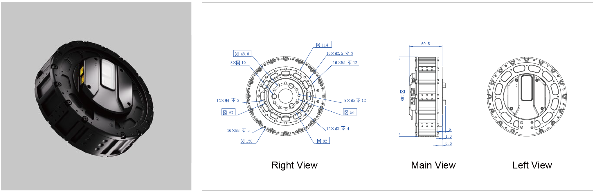

### Motor Output

| Motor Parameters | Value      | Electronics        | Value           |
| :--------------- | :--------- | :----------------- | :-------------- |
| Type             | BLDC       | Rated Voltage      | 48 VDC          |
| Rated Speed      | 1500 RPM   | Rated Current      | 45 A            |
| No load Speed    | 2500 RPM   | Encoder Resolution | 4000 Step/turn  |
| Rated Torque     | 11.16 Nm   | Protocol           | Ethernet UDP    |
| Torque Constant  | 0.372 Nm/A | Voltage Range      | 12 VDC ~ 48 VDC |

### Actuator Performance (Output)

| Type      | Reduction Ratio | Rated Torque/ Nm | Max Torque/Nm | Rated Speed/ RPM | Max Speed/ RPM |
| :-------- | :-------------- | :--------------- | :------------ | :--------------- | :------------- |
| FSA130-7E | 7               | 75.6             | 225           | 214              | 357            |

## FSA80-20-30

### Diagram

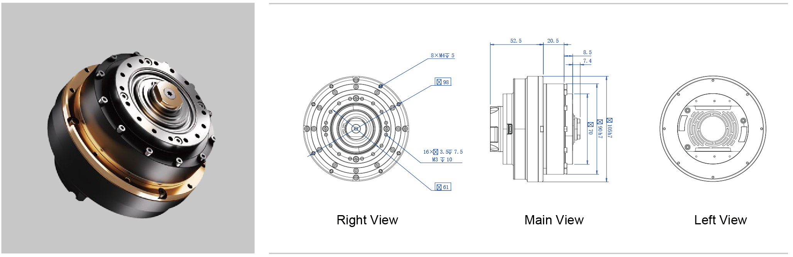

### Motor Output

| Motor Parameters | Value      | Electronics        | Value           |
| :--------------- | :--------- | :----------------- | :-------------- |
| Type             | BLDC       | Rated Voltage      | 48 VDC          |
| Rated Speed      | 2300 RPM   | Rated Current      | 7 A             |
| No load Speed    | 3500 RPM   | Encoder Resolution | 4000 Step/turn  |
| Rated Torque     | 1.13 Nm    | Protocol           | Ethernet UDP    |
| Torque Constant  | 0.161 Nm/A | Voltage Range      | 12 VDC ~ 48 VDC |

### Actuator Performance (Output)

| Type        | Reduction Ratio | Rated Torque/ Nm | Max Torque/Nm | Rated Speed/ RPM | Max Speed/ RPM |
| :---------- | :-------------- | :--------------- | :------------ | :--------------- | :------------- |
| FSA80-20-30 | 30              | 19               | 48            | 77               | 117            |

## FSA60-17-50

### Diagram

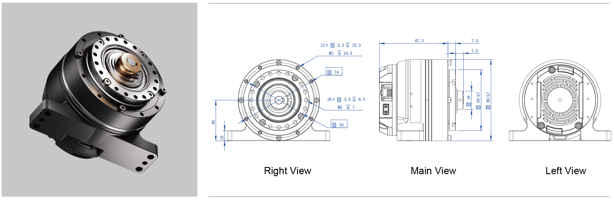

### Motor Output

| Motor Parameters | Value      | Electronics        | Value           |
| :--------------- | :--------- | :----------------- | :-------------- |
| Type             | BLDC       | Rated Voltage      | 48 VDC          |
| Rated Speed      | 6000 RPM   | Rated Current      | 9 A             |
| No load Speed    | 8000 RPM   | Encoder Resolution | 4000 Step/turn  |
| Rated Torque     | 0.55 Nm    | Protocol           | Ethernet UDP    |
| Torque Constant  | 0.062 Nm/A | Voltage Range      | 12 VDC ~ 48 VDC |

### Actuator Performance (Output)

| Type        | Reduction Ratio | Rated Torque/ Nm | Max Torque/Nm | Rated Speed/ RPM | Max Speed/ RPM |
| :---------- | :-------------- | :--------------- | :------------ | :--------------- | :------------- |
| FSA60-17-50 | 50              | 25               | 66            | 120              | 160            |

## FSA60-17-50-B

### Diagram

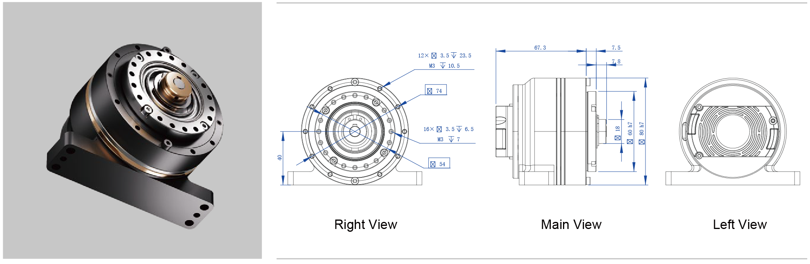

### Motor Output

| Motor Parameters | Value      | Electronics        | Value           |
| :--------------- | :--------- | :----------------- | :-------------- |
| Type             | BLDC       | Rated Voltage      | 48 VDC          |
| Rated Speed      | 6000 RPM   | Rated Current      | 9 A             |
| No load Speed    | 8000 RPM   | Encoder Resolution | 4000 Step/turn  |
| Rated Torque     | 0.55 Nm    | Protocol           | Ethernet UDP    |
| Torque Constant  | 0.062 Nm/A | Voltage Range      | 12 VDC ~ 48 VDC |

### Actuator Performance (Output)

| Type          | Reduction Ratio | Rated Torque/ Nm | Max Torque/Nm | Rated Speed/ RPM | Max Speed/ RPM |
| :------------ | :-------------- | :--------------- | :------------ | :--------------- | :------------- |
| FSA60-17-50-B | 50              | 25               | 66            | 120              | 160            |

## FSA60-17-50-C

### Diagram

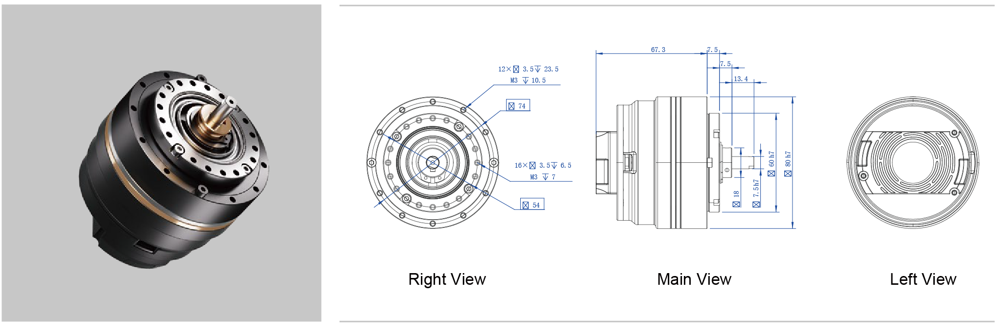

### Motor Output

| Motor Parameters | Value      | Electronics        | Value           |
| :--------------- | :--------- | :----------------- | :-------------- |
| Type             | BLDC       | Rated Voltage      | 48 VDC          |
| Rated Speed      | 6000 RPM   | Rated Current      | 9 A             |
| No load Speed    | 8000 RPM   | Encoder Resolution | 4000 Step/turn  |
| Rated Torque     | 0.55 Nm    | Protocol           | Ethernet UDP    |
| Torque Constant  | 0.062 Nm/A | Voltage Range      | 12 VDC ~ 48 VDC |

### Actuator Performance (Output)

| Type          | Reduction Ratio | Rated Torque/ Nm | Max Torque/Nm | Rated Speed/ RPM | Max Speed/ RPM |
| :------------ | :-------------- | :--------------- | :------------ | :--------------- | :------------- |
| FSA60-17-50-C | 50              | 25               | 66            | 120              | 160            |

## FSA36-11-30

### Diagram

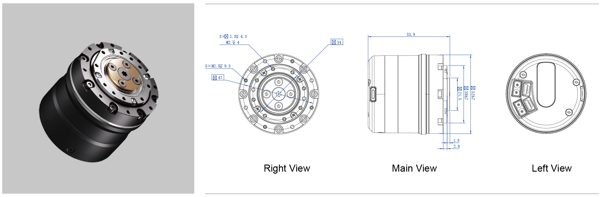

### Motor Output

| Motor Parameters | Value      | Electronics        | Value           |
| :--------------- | :--------- | :----------------- | :-------------- |
| Type             | BLDC       | Rated Voltage      | 48 VDC          |
| Rated Speed      | 2300 RPM   | Rated Current      | 7 A             |
| No load Speed    | 3500 RPM   | Encoder Resolution | 4000 Step/turn  |
| Rated Torque     | 1.13 Nm    | Protocol           | Ethernet UDP    |
| Torque Constant  | 0.161 Nm/A | Voltage Range      | 12 VDC ~ 48 VDC |

### Actuator Performance (Output)

| Type        | Reduction Ratio | Rated Torque/ Nm | Max Torque/Nm | Rated Speed/ RPM | Max Speed/ RPM |
| :---------- | :-------------- | :--------------- | :------------ | :--------------- | :------------- |
| FSA36-11-30 | 30              | 4                | 10.2          | 167              | 233            |

## FSA36-11-100

### Diagram

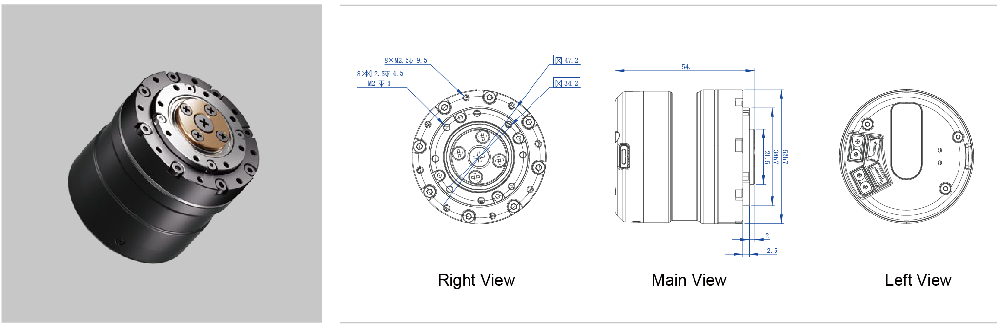

### Motor Output

| Motor Parameters | Value      | Electronics        | Value           |
| :--------------- | :--------- | :----------------- | :-------------- |
| Type             | BLDC       | Rated Voltage      | 48 VDC          |
| Rated Speed      | 2300 RPM   | Rated Current      | 7 A             |
| No load Speed    | 3500 RPM   | Encoder Resolution | 4000 Step/turn  |
| Rated Torque     | 1.13 Nm    | Protocol           | Ethernet UDP    |
| Torque Constant  | 0.161 Nm/A | Voltage Range      | 12 VDC ~ 48 VDC |

### Actuator Performance (Output)

| Type         | Reduction Ratio | Rated Torque/ Nm | Max Torque/Nm | Rated Speed/ RPM | Max Speed/ RPM |
| :----------- | :-------------- | :--------------- | :------------ | :--------------- | :------------- |
| FSA36-11-100 | 100             | 10.5             | 30            | 50               | 70             |

## FSA36-14-80

### Diagram

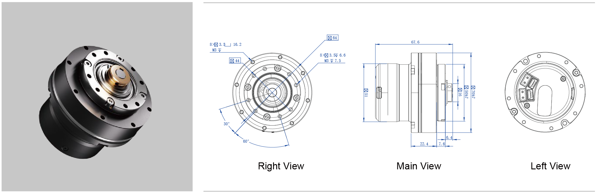

### Motor Output

| Motor Parameters | Value      | Electronics        | Value           |
| :--------------- | :--------- | :----------------- | :-------------- |
| Type             | BLDC       | Rated Voltage      | 48 VDC          |
| Rated Speed      | 5000 RPM   | Rated Current      | 2.4 A           |
| No load Speed    | 7000 RPM   | Encoder Resolution | 4000 Step/turn  |
| Rated Torque     | 0.156 Nm   | Protocol           | Ethernet UDP    |
| Torque Constant  | 0.058 Nm/A | Voltage Range      | 12 VDC ~ 48 VDC |

### Actuator Performance (Output)

| Type        | Reduction Ratio | Rated Torque/ Nm | Max Torque/Nm | Rated Speed/ RPM | Max Speed/ RPM |
| :---------- | :-------------- | :--------------- | :------------ | :--------------- | :------------- |
| FSA36-14-80 | 80              | 10.5             | 38            | 62               | 87             |

## FSA36B-36E

### Diagram

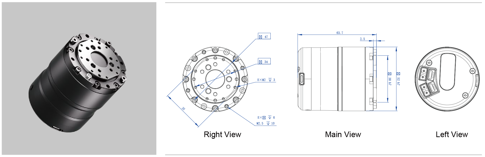

### Motor Output

| Motor Parameters | Value       | Electronics        | Value           |
| :--------------- | :---------- | :----------------- | :-------------- |
| Type             | BLDC        | Rated Voltage      | 48 VDC          |
| Rated Speed      | 5000 RPM    | Rated Current      | 2.4 A           |
| No load Speed    | 7000 RPM    | Encoder Resolution | 4000 Step/turn  |
| Rated Torque     | 0.222 Nm    | Protocol           | Ethernet UDP    |
| Torque Constant  | 0.0925 Nm/A | Voltage Range      | 12 VDC ~ 48 VDC |

### Actuator Performance (Output)

| Type       | Reduction Ratio | Rated Torque/ Nm | Max Torque/Nm | Rated Speed/ RPM | Max Speed/ RPM |
| :--------- | :-------------- | :--------------- | :------------ | :--------------- | :------------- |
| FSA36B-36E | 36              | 8                | 15            | 139              | 194            |

## FSA25-08S-30

### Diagram

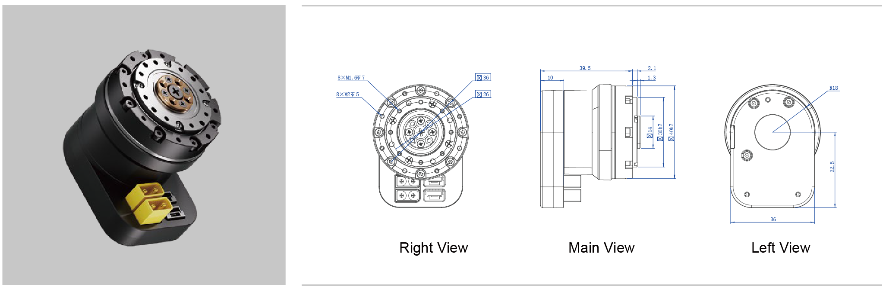

### Motor Output

| Motor Parameters | Value      | Electronics        | Value           |
| :--------------- | :--------- | :----------------- | :-------------- |
| Type             | BLDC       | Rated Voltage      | 48 VDC          |
| Rated Speed      | 6000 RPM   | Rated Current      | 0.9 A           |
| No load Speed    | 8000 RPM   | Encoder Resolution | 4000 Step/turn  |
| Rated Torque     | 0.054 Nm   | Protocol           | Ethernet UDP    |
| Torque Constant  | 0.047 Nm/A | Voltage Range      | 12 VDC ~ 48 VDC |

### Actuator Performance (Output)

| Type         | Reduction Ratio | Rated Torque/ Nm | Max Torque/Nm | Rated Speed/ RPM | Max Speed/ RPM |
| :----------- | :-------------- | :--------------- | :------------ | :--------------- | :------------- |
| FSA25-08S-30 | 30              | 1.62             | 3.95          | 200              | 267            |

## FSA25-08-30

### Diagram

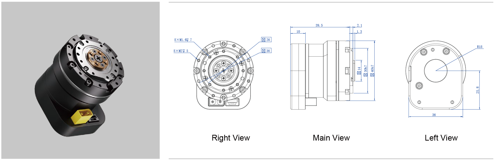

### Motor Output

| Motor Parameters | Value      | Electronics        | Value           |
| :--------------- | :--------- | :----------------- | :-------------- |
| Type             | BLDC       | Rated Voltage      | 48 VDC          |
| Rated Speed      | 6000 RPM   | Rated Current      | 0.9 A           |
| No load Speed    | 8000 RPM   | Encoder Resolution | 4000 Step/turn  |
| Rated Torque     | 0.054 Nm   | Protocol           | Ethernet UDP    |
| Torque Constant  | 0.047 Nm/A | Voltage Range      | 12 VDC ~ 48 VDC |

### Actuator Performance (Output)

| Type        | Reduction Ratio | Rated Torque/ Nm | Max Torque/Nm | Rated Speed/ RPM | Max Speed/ RPM |
| :---------- | :-------------- | :--------------- | :------------ | :--------------- | :------------- |
| FSA25-08-30 | 30              | 1.62             | 3.95          | 200              | 267            |

## FSA25-08S-30-B

### Diagram

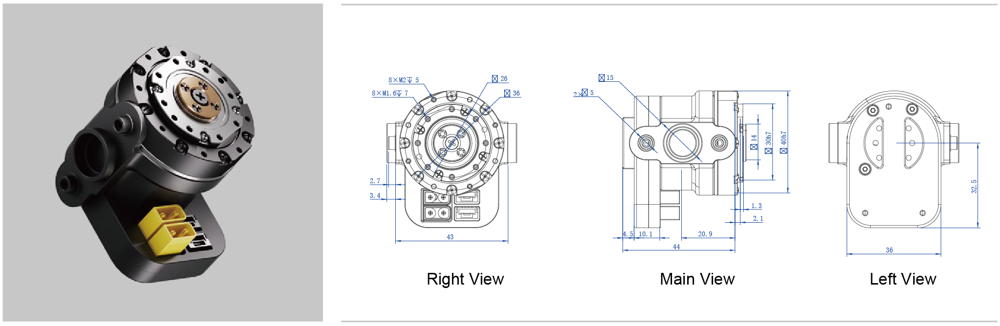

### Motor Output

| Motor Parameters | Value      | Electronics        | Value           |
| :--------------- | :--------- | :----------------- | :-------------- |
| Type             | BLDC       | Rated Voltage      | 48 VDC          |
| Rated Speed      | 6000 RPM   | Rated Current      | 0.9 A           |
| No load Speed    | 8000 RPM   | Encoder Resolution | 4000 Step/turn  |
| Rated Torque     | 0.054 Nm   | Protocol           | Ethernet UDP    |
| Torque Constant  | 0.047 Nm/A | Voltage Range      | 12 VDC ~ 48 VDC |

### Actuator Performance (Output)

| Type           | Reduction Ratio | Rated Torque/ Nm | Max Torque/Nm | Rated Speed/ RPM | Max Speed/ RPM |
| :------------- | :-------------- | :--------------- | :------------ | :--------------- | :------------- |
| FSA25-08S-30-B | 30              | 1.62             | 3.95          | 200              | 267            |

## FSA25-08S-30-B

### Diagram

### Motor Output

| Motor Parameters | Value      | Electronics        | Value           |
| :--------------- | :--------- | :----------------- | :-------------- |
| Type             | BLDC       | Rated Voltage      | 48 VDC          |
| Rated Speed      | 6000 RPM   | Rated Current      | 0.9 A           |
| No load Speed    | 8000 RPM   | Encoder Resolution | 4000 Step/turn  |
| Rated Torque     | 0.054 Nm   | Protocol           | Ethernet UDP    |
| Torque Constant  | 0.047 Nm/A | Voltage Range      | 12 VDC ~ 48 VDC |

### Actuator Performance (Output)

| Type           | Reduction Ratio | Rated Torque/ Nm | Max Torque/Nm | Rated Speed/ RPM | Max Speed/ RPM |
| :------------- | :-------------- | :--------------- | :------------ | :--------------- | :------------- |
| FSA25-08S-30-B | 30              | 1.62             | 3.95          | 200              | 267            |
