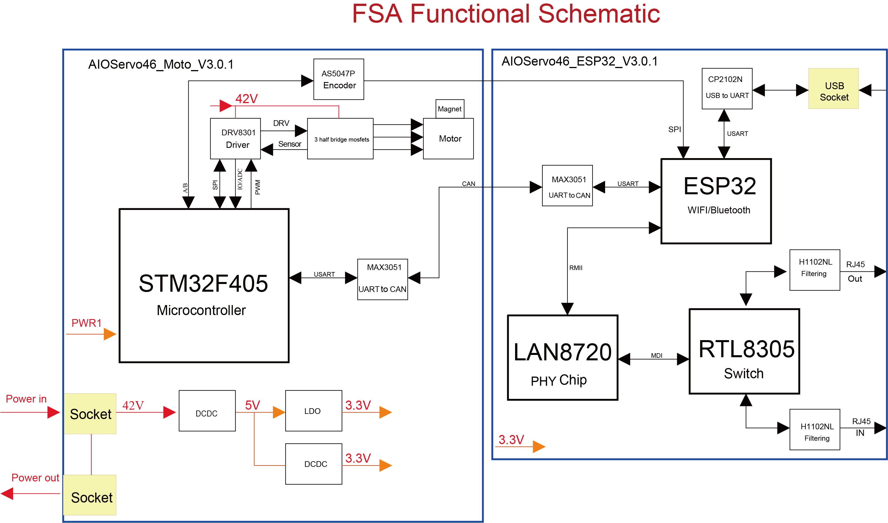

# Functional Schematic

The functional schematic provides a comprehensive blueprint outlining the inner workings of the FSA (Functional Schematic Actuator), specifically focusing on the actuator's wiring and operations within the robotic system. This schematic serves as the foundation for understanding how data flows and controls the actuator to achieve precise and dynamic movements in the robotic system.

## Data Flow Initiation

The journey of data begins at the [STM32F405 ](https://www.st.com/resource/en/datasheet/stm32f405oe.pdf)microcontroller, which is the primary processing unit. This microcontroller is the brain behind the operation, responsible for sending control commands through various interfaces to encoder and driver. USART and CAN communication interfaces. The USART is further interfaced with a MAX3051 chip, which converts these signals to CAN protocol, allowing for robust industrial communication. These interfaces are crucial for transmitting precise instructions to the motor and other components.

### USART and CAN Communication

The STM32F405 microcontroller utilizes USART and CAN communication interfaces for data transmission. The USART interface is further connected to a [MAX3051 ](https://www.analog.com/media/en/technical-documentation/data-sheets/MAX3051.pdf)chip , which plays a pivotal role in converting these signals into the CAN protocol. This conversion is essential for establishing robust industrial communication, ensuring that control commands are relayed accurately.

## Motor Control via DRV8301

The heart of the motor's motion control lies within the [DRV8301 ](https://www.ti.com/lit/ds/symlink/drv8301.pdf?ts=1705040622532&ref_url=https%253A%252F%252Fwww.mouser.cn%252F)motor driver. This integrated circuit (IC) acts as the intermediary between the microcontroller's commands and the physical movements of the motor. Its compact yet powerful design enables it to handle the intricate demands of controlling the robotic motor.

### Functional Capabilities of DRV8301

The DRV8301 offers a wide range of functional capabilities, including:

* **Speed Control**: Modulating the power supplied to the motor to achieve a spectrum of speeds, from delicate and precise movements to rapid motions.
* **Direction Control**: Reversing the motor's direction by changing the polarity of the supply voltage.
* **Torque Management**: Adjusting the current supply to the motor to control torque and consequently the force applied by the robot.

### Microcontroller Interface

The DRV8301 motor driver receives digital signals from the STM32F405 microcontroller. These signals contain instructions specifying the desired speed, direction, and torque for the motor. The motor driver then translates these digital signals into appropriate analog outputs that directly drive the motor.

### Pin Layout and Signal Inputs

The DRV8301 features various pins serving distinct purposes:

* **Power Supply Pins**: These pins connect to the power source, ensuring that the IC receives the necessary voltage and current to function optimally.
* **Output Pins**: Directly linked to the motor, these pins deliver the driving signals essential for controlling motor movement.
* **Input Pins**: Receiving logic signals from the microcontroller, these pins dictate motor behavior.
* **Feedback Pins**: Transmitting real-time information back to the microcontroller, these pins report on the motor's status, including any fault conditions.

### Power Outputs

The DRV8301 is equipped with three half-bridges that provide power to the motor. These bridges are capable of delivering high current output.

### System Protection

Integral to the DRV8301 are numerous protection features, including under-voltage lockout, over-current protection, and thermal shutdown mechanisms. These safeguards are critical in preventing damage to both the motor driver and the motor itself under extreme operating conditions.

## Precise Positional Feedback via AS5047P

The [AS5047P ](https://ams.com/documents/20143/36005/AS5047P_DS000324_3-00.pdf)magnetic encoder plays a pivotal role in ensuring precise control of the robot's movements. This encoder is a specialized sensor that detects the angular position of the motor's shaft using magnetic fields. It provides real-time positional feedback to the microcontroller, enabling the robot to achieve accurate and consistent movements.

### Operating Principle of AS5047P

The AS5047P operates as follows:

* **Magnetic Sensing**: The encoder utilizes a magnet attached to the motor shaft. As the shaft rotates, the encoder senses changes in the magnetic field.
* **Position Calculation**: These magnetic field changes are converted into digital signals that represent the exact position of the motor shaft.
* **Resolution and Precision**: The AS5047P offers high-resolution output, allowing it to detect minute changes in position, critical for precise control of the robot.

### Integration with Motor Control

The encoder's data is an integral part of a feedback loop within the system. It is continuously compared with the desired position, as instructed by the microcontroller. Any discrepancies are promptly addressed by adjusting the motor's drive signals, ensuring real-time corrections to the robot's movement.

### Encoder Output and Communication

The AS5047P typically communicates with the microcontroller via a digital interface, such as SPI (Serial Peripheral Interface), which facilitates high-speed data transmission. Furthermore, the encoder can provide diagnostics and status information, alerting the system to potential issues such as misalignment or magnet malfunction.

## Power Management for Stability

In the context of robot, power management goes beyond supplying energy. It encompasses the crucial task of ensuring that power is delivered stably, efficiently, and safely to all components. Power management chips play a critical role in safeguarding the electrical system of the robot.

### Roles of Power Management Chips

Power management chips fulfill several critical roles:

* **Voltage Regulation**: These chips maintain stable voltage levels within operational limits for various components, preventing fluctuations that could lead to inefficiencies or damage.
* **Current Distribution**: They manage the distribution of current to different parts of the robot, ensuring balanced performance across all systems.
* **Protection Mechanisms**: Power management chips include protection features such as over-current protection and thermal shutdown to safeguard against excessive current, overheating, and damage.

### Understanding Power Pathways

The schematic outlines the journey of electrical power from its source through the power management chips to various components of the robot. These chips are not mere pass-through devices; they optimize power usage by converting higher voltages to lower ones where necessary, ensuring efficient power utilization.

### Safeguards and Diagnostics

Many power management chips are equipped with diagnostic capabilities, allowing real-time monitoring of voltage and current levels. This capability is crucial for predictive maintenance, helping prevent unexpected downtime. In case of electrical anomalies, these chips can detect issues and respond appropriately, often by shutting down the affected circuit to prevent further damage.

## STM32F405 Microcontroller: The Central Brain

At the core of the schematic lies the STM32F405 microcontroller, serving as the central nervous system of the robot. This microcontroller processes sensor inputs, sends precise control signals to the motor driver, and executes the software that imparts intelligence to the robot. In this section, we delve into the microcontroller's specifications, programming, and its vital role in maintaining connectivity with other components.

The schematic centers around the STM32F405 microcontroller, depicted as a large rectangle. It interfaces with various components:

* **Power Supply** : Two red arrows indicate power entering the system. The first arrow, labeled "42V", leads to a block marked "DCDC", which steps the voltage down to "5V". The second arrow feeds into another "DCDC" block that outputs "3.3V". From the "5V" output, an orange arrow points to a block labeled "LDO", which further regulates down to "3.3V", with a corresponding orange arrow pointing towards the microcontroller.
* **Motor Driver Connection** : On the top side, a red arrow points from the "42V" source to the "DRV8301" motor driver block. Three black arrows flow from the motor driver to the STM32F405, marked with "DRV", "SENSE", and a symbol suggesting a motor or output function.
* **Encoder Interface** : To the right of the motor driver, a block labeled "AS5047P" is connected by a red arrow pointing to the right, indicating the flow of data from the encoder to the microcontroller.
* **Communication Modules** : To the left of the STM32F405, two black arrows indicate communication lines. One connects to a block marked "MAX3051" with the label "USART & CAN", suggesting serial communication interfaces. The other arrow points to a space outside the schematic, implying an external connection.
* **Peripheral Connections** : Below the STM32F405, two orange arrows show additional voltage inputs from the "LDO" and "DCDC" converters.

This setup illustrates the STM32F405 as the central hub, orchestrating the robot's operations by integrating power management, motion control through the DRV8301, and feedback via the AS5047P encoder. The microcontroller also maintains communication with external devices and systems through USART and CAN, facilitated by the MAX3051. The STM32F405's role is pivotal, enabling the coordination and execution of complex tasks that the robot must perform.

### STM32F405 Microcontroller: The Central Brain

**Position and Role:**

* Occupying a central position in the schematic, the STM32F405 microcontroller is depicted as a large black square, underscored with the label "主机机" (main machine).
* It functions as the control hub, interpreting sensor data, managing communications, and driving the actuator with precision.

**Connections:**

* Above the STM32F405, connected via a bidirectional black arrow, is the "AS5047P" encoder, which provides high-resolution positional feedback for the motor.
* To the left of the encoder, a red arrow points from a "42V" power supply source to the "DRV8301" motor driver, which is also linked to the STM32F405 by several lines indicating multiple control interfaces: a bidirectional black arrow for "SPI" communication, a black line marked "IO/ADC" for input/output and analog-to-digital conversion, and another black line labeled "PWM" indicating pulse-width

**STM32F405 Microcontroller: The Central Brain**

* The STM32F405 microcontroller is the heart of the system, depicted as a substantial rectangular block located centrally at the bottom of the left half of the schematic.
* From the left, a red arrow labeled "PWR1" points to the STM32F405, indicating power input to the microcontroller.

**Specifications:**

* The STM32F405 is equipped to handle a complex array of tasks, from processing sensor inputs to executing intricate control algorithms.
* Its connections reflect its central role. It interfaces with a variety of other components, as detailed by the arrows and lines stemming from it.

**Programming and Connectivity:**

* Arrows indicate various communication protocols and functionalities:
  * An SPI connection, represented by a bidirectional arrow, connects the STM32F405 to the "AS5047P" magnetic encoder, allowing for high-fidelity position feedback.
  * A line marked "USART & CAN" extends towards a "MAX3051" chip, suggesting serial communication capabilities for networking with external systems.
  * Multiple black lines connect the STM32F405 to the "DRV8301" motor driver, labeled with "DRV," "SENSE," and PWM among others, indicating the flow of control signals for motor operation.

**Power Regulation:**

* Adjacent to the STM32F405

The schematic features the STM32F405 microcontroller prominently at the lower center, acting as the central brain of the control system. It's depicted as a large black rectangle with the following connections:

* **Power Input:** An orange arrow labeled 'PWR1' points towards the STM32F405, indicating the power entry point to the microcontroller.
* **Voltage Inputs:** Two red arrows come in from the left, marked '电源入' (Power In). They point to two smaller rectangles labeled 'DCDC' and 'LDO', which then have orange arrows pointing towards the STM32F405 indicating 5V and 3.3V power lines, respectively.
* **Motor Driver Connection:** Directly above the STM32F405, a red arrow points upwards to a rectangle labeled 'DRV8301' (motor driver), which has a bidirectional connection with the microcontroller, marked with lines labeled 'SPI', 'IO/ADC', and 'PWM' indicating different control interfaces.
* **Encoder Connection:** A block labeled 'AS5047P' (encoder) is connected with two bidirectional arrows marked 'A/B', indicating a differential signal interface.
* **Communication Interface:** To the left of the STM32F405, a bidirectional arrow leads to a block labeled 'MAX3051', marked 'USART & CAN', showing serial communication pathways.

This visual arrangement paints a picture of a tightly integrated system where the STM32F405 is the orchestrating center, processing inputs and outputs to control a motor via the DRV8301, receiving position feedback from the AS5047P, and managing communication through USART and CAN protocols. The power regulation is carefully managed by dedicated converters ensuring the microcontroller and associated peripherals receive

## Lifelines of Connectivity: Communication Interfaces

Effective communication with external devices and systems is as vital for the robot as its mechanical movements. The schematic highlights the various communication interfaces that form the nexus between the robot and the outside world. We explore the USB, CAN, and USART interfaces, each fulfilling a unique role in data transfer and command reception.

### Universal Serial Bus (USB)

USB interfaces are commonly used for direct connections to computers or other control systems, ideal for high-speed data transfer and command input. In the context of robotics, USB serves purposes such as firmware updates, parameter configuration, or data logging. This section provides insights into USB data transfer rates, connector types, and protocol standards relevant to robot applications.

### Controller Area Network (CAN)

CAN is a robust communication protocol designed for reliable communication in harsh environments, making it suitable for industrial robotic applications. It is used for networking multiple robots or connecting the robot to industrial control systems. Here, we delve into CAN's multi-master design, message prioritization, and error-handling capabilities.

### Universal Synchronous/Asynchronous Receiver/Transmitter (USART)

USART is an integral communication interface in microcontroller-based systems, offering flexibility with its dual modes: synchronous for clocked data exchange and asynchronous for start-stop communication. This versatility is essential for the multifaceted communication demands of robotic systems.

#### Function in Robotics

In robotics, USART interfaces play a pivotal role in issuing real-time control commands that dictate robot movements and actions. They also facilitate the relay of sensor data back to the control unit, enabling responsive adjustments to the robot's operation. Moreover, USARTs ensure backward compatibility with older technologies, allowing integration with legacy systems in industrial settings.

#### Technical Insights

The technicalities of USART involve configuring baud rates (communication speed) to ensure data rates match between communicating devices. Synchronization mechanisms are crucial, especially in synchronous mode, where precise timing is maintained between sender and receiver. Framing structures define data packet formats, including start and stop bits in asynchronous mode, data bits, parity, and error checking. In robotics, these parameters are meticulously tuned to ensure accurate and reliable data transfer for actuator control and sensor feedback.

### Protocols, Wiring, and Data Flow

Understanding communication protocols is key to ensuring compatibility and efficiency in data exchange. Proper wiring practices are crucial for maintaining signal integrity under the electromechanical stresses encountered during operation. Data flow analysis examines how data moves through these interfaces, enabling seamless command reception and data export.

## Protocol Hierarchy and Wiring Integrity

The schematic delineates the protocol hierarchy within the motor driver circuitry, utilizing industry-standard communication protocols to ensure synchronized data exchange between the motor driver and the controlling firmware. The schematic emphasizes the importance of wiring integrity, specifying gauge, shielding, and routing of wires essential for maintaining signal integrity under electromechanical stresses during operation.

## Comprehensive Data Flow Analysis

A comprehensive data flow analysis is provided within the schematic, tracing the journey of command and control signals from their origin to execution. This includes pathways for power signals, feedback loops for system status, and interrupt signals for real-time adjustments, culminating in an integrated network of bidirectional data exchange.

This high-level overview of the data flow underscores the seamless interaction between processing, control, and feedback elements, creating a sophisticated and responsive system for motor control within the robot.

In conclusion, the functional schematic provides an invaluable insight into the intricate workings of the FSA, highlighting the crucial components, data flow, and control mechanisms that enable precise and dynamic movements in the robot. Understanding this schematic is fundamental to grasping the inner workings of the robot system and its capabilities.
