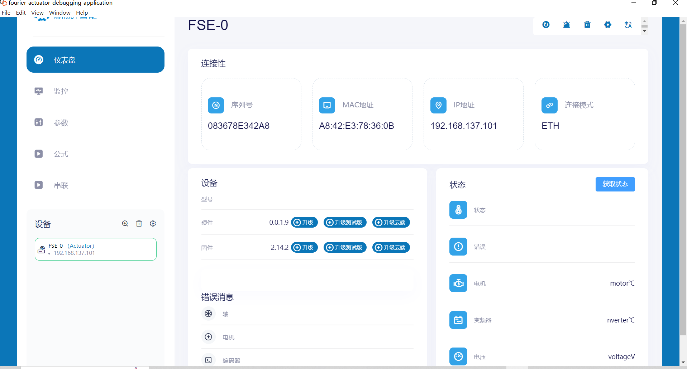
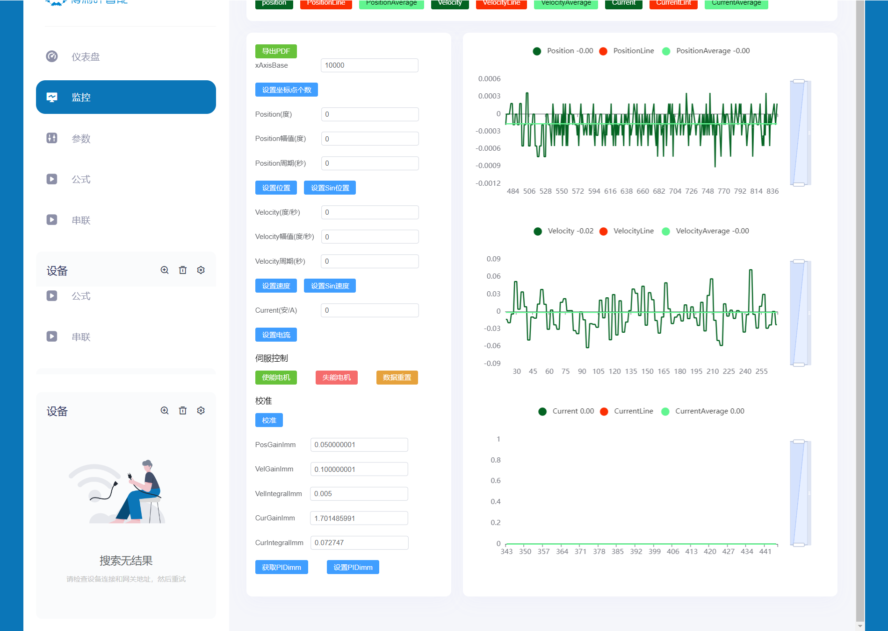
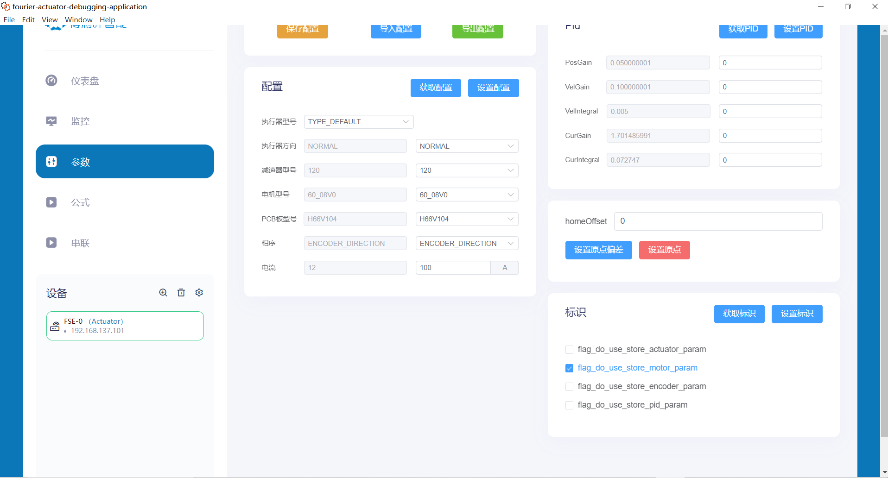
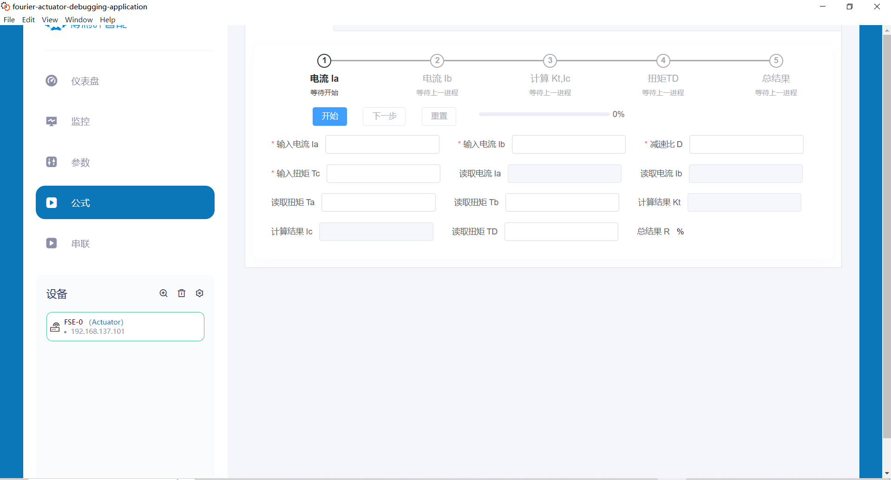
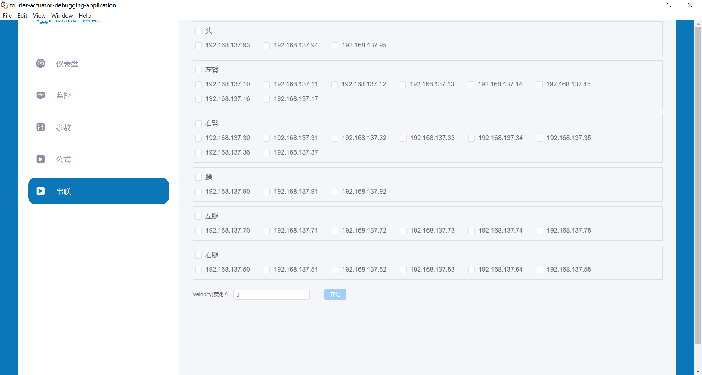

# 主界面介绍

Fourier执行器调试工具的主界面是用户与执行器交互的中心。它设计得既直观又功能丰富，以帮助用户有效地进行设备监控和参数调整。

## 界面布局

界面被划分为多个区域，每个区域都有其独特的功能和用途：

### 顶部功能按钮

* **重启** ：快速重启选定的执行器或编码器，适用于软件更新或错误修正后的重新初始化。
* **获取错误** ：提取执行器或编码器的错误日志，用于分析和解决问题。
* **清除错误** ：一旦诊断并解决问题，可以清除执行器或编码器的错误记录。
* **网络设置** ：配置执行器或编码器的IP地址和其他网络相关参数。
* **语言设置** ：切换界面显示语言，以满足不同用户的语言偏好。

### 左侧导航栏

左侧导航栏为用户提供了五个主要的操作标签页：

* **仪表盘** ：快速查看执行器的状态，包括型号、序列号、固件版本，以及当前工作模式。
* **监控** ：实时监测执行器的性能，包括位置、速度、电流以及其他关键参数的动态图表展示。
* **参数** ：详细的参数配置界面，用于精细调整执行器的运行参数，如PID控制系数。
* **公式** ：一个高级脚本编辑器，用于编写和调试复杂的运动控制逻辑和算法。
* **串联** ：管理执行器网络，配置多个执行器以实现协同工作。

## 标签页内容详解

### 仪表盘（Dashboard）

仪表盘提供执行器的实时状态和概览信息。在此页面，用户可以看到执行器的型号、序列号、MAC地址、IP地址以及连接状态。还包括诸如型号、固件版本、硬件信息等详细信息。

### 监控（Monitoring）

监控页面为用户提供了一个实时数据流视图，其中包含执行器的关键性能指标。这些指标以图表形式显示，如位置和速度的实时曲线图。用户可以根据需要调整图表的参数，比如设置不同的时间范围和测量单位。

### 参数（Parameters）

参页面是设置和调整执行器各种操作参数的地方。它包含多个部分，每个部分专注于不同的参数设置，如电机类型、电机参数、编码器方向等。此外，还有对PID控制参数的细节调整，包括位置增益、速度增益和积分时间等。

### 公式（Formulas）

公式页面允许用户输入特定的公式或脚本，以实现复杂的执行器控制逻辑。这个强大的功能提供了对执行器精确控制的可能，比如通过特定算法来定义执行器的运动路径。

### 串联（Serial Connection）

串联页面用于设置和管理一个网络中的多个执行器。用户可以在这里查看网络中所有执行器的状态，添加新的执行器，配置它们的网络参数，以及设置它们之间的协作模式。

