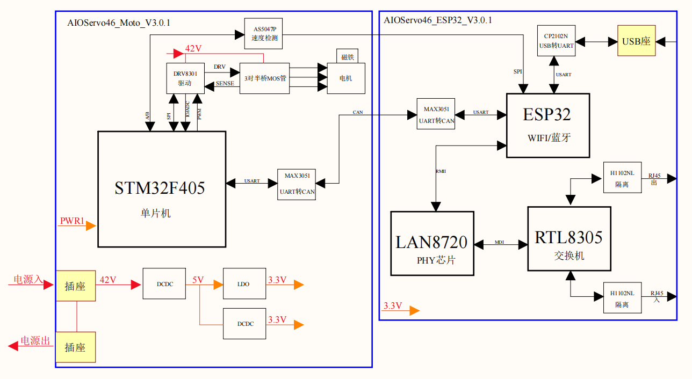

# 简介

## 手册目的

本用户手册旨在为用户提供Fourier执行器调试工具的详细指导，帮助用户有效地安装、配置以及使用该软件进行执行器的调试。本手册适用于需要对执行器进行常规检测、故障排除和参数配置的技术人员和维护人员。通过本手册，用户将能够快速掌握软件的操作流程，确保执行器能够在各种工况下保持最佳性能。

## 执行器概览

执行器功能框图如下：

STM32F405微控制器是整个系统的核心处理单元。微控制器通过USART和CAN接口发送控制指令，其中USART通过MAX3051芯片将其转换为CAN协议，以确保通信的稳定性和可靠性。

这些控制指令被DRV8301电机驱动器接收，并经过精确的处理，转化为控制电机电流的信号。同时，这个驱动器还与ESP32连接，ESP32支持通过Wi-Fi或蓝牙进行无线控制，为远程操控和监控提供了更多可能性。

在系统中，AS5047P磁性编码器扮演着重要的角色，通过SPI接口实时反馈电机的位置信息给微控制器。这个反馈环节对于确保电机准确地达到预定位置至关重要。

在电源管理方面，系统采用了一系列DC-DC转换器和LDO，以确保各个部件获得适当的电压供应。这些电源管理元件不仅提供所需的电能，还有效地预防电气故障，保障了整个系统的数据完整性和安全运行。

## 执行器调试工具概览

Fourier执行器调试工具是一款专业的应用软件，旨在为用户提供一个直观、易用的界面，以进行执行器的实时监控和调试。该工具支持多种调试功能，包括但不限于：

* **连接管理** ：快速连接和识别执行器，支持通过IP或MAC地址进行搜索和连接。
* **历史记录** ：记录执行器的工作状态和参数变更历史，便于回溯和问题分析。
* **参数设置** ：允许用户读取和设置执行器的工作参数，以适应不同的工作环境。
* **日志功能** ：自动记录所有操作和执行器的响应，用于故障排查和技术分析。

软件界面设计简洁明了，易于导航，使得用户能够无需长时间的培训即可上手使用。此外，本工具还提供了故障排查向导和常见问题解答（FAQs），帮助用户快速解决使用过程中遇到的问题。

在接下来的章节中，我们将详细介绍如何利用本工具进行执行器的调试工作。
